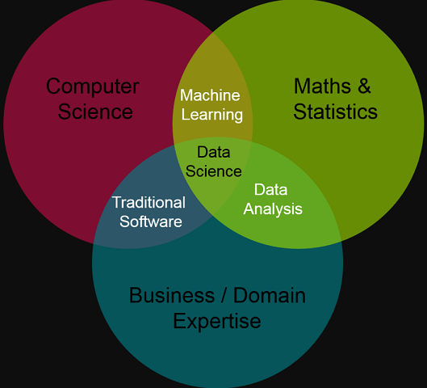

```{r setup, include=FALSE}
options(htmltools.dir.version = FALSE)
```

class: center, middle
# Модуль 1. Базовий

---
## <span style="color:darkblue"> Лекції 1 - 2. Типовий Data Science-проект у cередовищі R: мета, задачі, інструментарій

* Що таке інтелектуальний аналіз даних (ІАД, Data Mining)?
    + Задачі, які дозволяє вирішити ІАД в конкретних галузях
    + Приклади успішних проектів із застосуванням технології ІАД 
* Що таке Data Science? 
* Що таке Data Science-проект? 
* Структура типового Data Science-проекту
* Концепція грамотного програмування
    + Markdown і RMarkdown
    + Інсталяція R
    + Інсталяція RStudio
    + Створення RMarkdown-документу
    + Генерація електронного документу
* Ресурси

---

## <span style="color:darkblue"> Що таке інтелектуальний аналіз даних (ІАД, Data Mining)?

__Постановка задачі.__

1. __Є__ досить великі __дані__ (база даних, або просто дані, розкидані в Інтернеті, тощо)

2. Передбачається, що в даних знаходяться якісь «приховані знання».

Необхідно розробити методи виявлення знань, прихованих у великих обсягах вихідних «сирих» даних. 

3. __Розроблені інженерні рішення__, які здатні самостійно знаходити __приховані практично корисні знання__, і власне __знання__ -- це високомонетизуєма продукція.

У поточних умовах глобальної конкуренції саме знайдені закономірності (знання) можуть бути джерелом додаткової конкурентної переваги.

---

## <span style="color:darkblue"> Приклади успішних Data Science проектів

* Дослідники зі Стенфордського Університету в Каліфорнії вивчили базу даних FDA (Food and Drug Administration -- Управління з контролю за харчовими продуктами і лікарськими препаратами) побічних ефектів ліків і виявили, що два часто використовуваних препарати -- антидепресант пароксетин і правастатин, використовуваний для зниження рівня холестерину -- збільшують ризик розвитку діабету, якщо вживаються спільно.


---

## <span style="color:darkblue"> Приклади успішних Data Science проектів

* Фахівці одного з супермаркетів міжнародної мережі Wal-mart, встановили,
що у п’ятницю ввечері пиво чомусь краще продається разом з дитячими підгузниками. Менеджери, скориставшись цим фактом, розташували зі стелажем з підгузниками стелаж з найдорожчим пивом, що дало можливість підняти продажі даного сорту у рази.


---

## <span style="color:darkblue"> Приклади успішних Data Science проектів

* __Випускниця аспірантури кафедри КІС КрнУ [Слабченко Олеся](https://www.linkedin.com/in/olesia-slabchenko-a38225137/), нині PhD, Senior Data Scientist, EPAM Ukraine__ (наук. керівник доц. Сидоренко В. М.) створила інформаційну технологію,  __що дозволяє відновлювати з ймовірністю близько 80-85%__ невказані власником акаунту __соціальної мережі персональні дані__, як то __“стать”, “вік”, “рік закінчення школи”, “сімейний стан”__ тощо. Застосування технології може суттєво підвищити достовірність у задачах пошуку цільових груп __в задачах маркетингу, реклами, інформаційних війн, з’ясування інформації щодо злочинця__ тощо. 


---

## <span style="color:darkblue"> Приклади успішних Data Science проектів

* __ Emonito Project__. Інформаційна технологія моніторингу соціальних медіа. Дозволяє виконувати збір, обробку, аналіз та візуалізацію складного текстового контента із соціальних медіа. Виконувати багатопоточний аналіз складного текстового контента (+ смайли, емодзі, сленг і т.п.) на предмет семантичної і сентимент-складової у реальному часі. Сегментування і класифікацію користувачів за манерою письма та вираження емоцій. Наразі створюється пілотний проєкт в рамках
команди Sentiment Group (студенти і випускники каф. КІЕ, кер. доц. В. Сидоренко).


---

## <span style="color:darkblue"> Два типи проектів з ІАД


* __Разове рішення__ - на виході приховані корисні для бізнесу знання. Товар - приховані знання

* __Тиражування знань експертів__ - на виході інформаційна технологія, що дозволяє отримувати прихованні корисні для бізнесу знання. Товар -- інформаційна технологія

---

class: middle

* ### <span style="color:darkblue"> Як працює технологія Data mining і з чого вона складається?

* ### <span style="color:darkblue"> Що необхідно знати і вміти, щоби навчитись застосовувати дану IT-технологію на практиці?

---


---

## <span style="color:darkblue"> Визначення інтелектуального аналізу даних (Data Mining)

__Data Mining__ (DM, Інтелектуальний Аналіз Даних, ІАД) -– виявлення в «сирих» даних раніше невідомих, нетривіальних, практично корисних і доступних інтерпретації знань, необхідних для прийняття рішень у різних сферах людської діяльності (_Г. Пятецький-Шапіро_). 

В сучасному контексті ІАД доцільно розглядати як частину _науки про дані_ -- __Data Science__.

---

## <span style="color:darkblue"> Що таке Data Science? 


__Data Science (наука про дані)__ -- розділ інформатики, що вивчає проблеми аналізу, обробки і представлення даних у цифровій формі. Об'єднує методи по обробці даних в умовах великих обсягів і високого рівня паралелізму, статистичні методи, методи інтелектуального аналізу даних і застосунки штучного інтелекту для роботи з даними, а також методи проектування і розробки баз даних (Вікіпедія).

Фахівець -- __Data Scientist__.

---

## <span style="color:darkblue">  Яким вимогам має відповідати Data Scientist?



---

## <span style="color:darkblue">  Що таке Data Science-проект?

Будь-який Data Science-проект (альтернативна назва -- Data Mining-проект) має на меті реалізацію на практиці методології [CRISP DM](https://www.the-modeling-agency.com/crisp-dm.pdf) [@CRISP_DM].


---

Якщо виділити з даного процесу суто технологічну складову, то типова технологічна основа будь-якого Data Science-проекту має виглядати наступним чином [@r4ds].  


---

## <span style="color:darkblue"> Концепція грамотного програмування

* Markdown і RMarkdown
* Інсталяція R
* Інсталяція RStudio
* Створення RMarkdown-документу
* Генерація електронного документу

---

## <span style="color:darkblue"> Ресурси

### Загальні

* [kdnuggets](https://www.kdnuggets.com/)
* [Data Scince Central](https://www.datasciencecentral.com)

### R

* [The Comprehensive R Archive Network](https://cran.r-project.org/)
* [R-bloggers](https://www.r-bloggers.com/)
* [Bioconductor](https://www.bioconductor.org/)
* [Satistics with R](http://zoonek2.free.fr/UNIX/48_R/all.html)

### Python

* [Открытый курс машинного обучения](https://habr.com/ru/company/ods/blog/322626/)
* [Настройка Data Science окружения на вашем компьютере](https://medium.com/nuances-of-programming/%D0%BD%D0%B0%D1%81%D1%82%D1%80%D0%BE%D0%B9%D0%BA%D0%B0-data-science-%D0%BE%D0%BA%D1%80%D1%83%D0%B6%D0%B5%D0%BD%D0%B8%D1%8F-%D0%BD%D0%B0-%D0%B2%D0%B0%D1%88%D0%B5%D0%BC-%D0%BA%D0%BE%D0%BC%D0%BF%D1%8C%D1%8E%D1%82%D0%B5%D1%80%D0%B5-2053199a9043)
* [Настраиваем Python для машинного обучения на Windows](https://proglib.io/p/ml-python-setup/)

---

class: center, middle

# Дякую за увагу! 

---
class: inverse, center, middle

# Get Started

---

## References

